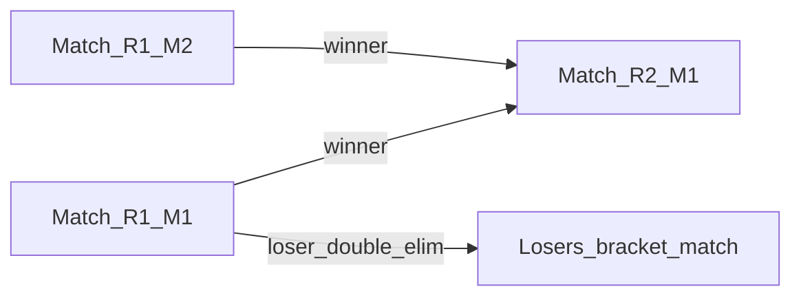

# Four Bagger

Four Bagger is a Spring Boot backend for organizing cornhole games and single- and double-elimination tournaments. It
supports user authentication, standalone singles and doubles games, tournament registration via join codes, bracket
generation, round-level best-of configuration, and automatic bracket progression as final match results are submitted.

I built this project because I wanted something my family could actually use during cornhole tournaments at family
functions, and I wanted a backend project that pushed me beyond basic CRUD. The goal was to practice backend engineering
in a project with real domain rules and real state transitions.

## Highlights

- JWT-based authentication with refresh-token rotation and HttpOnly cookies
- Standalone singles and doubles game support
- Single- and double-elimination tournament lifecycle from registration through bracket generation to live match
  progression
- Graph-based bracket routing — matches are wired as nodes with winner and loser edges that drive automatic advancement
- Configurable round rules with `bestOf` series support
- Final-result scoring for standalone games and tournament physical games (winner + both scores)
- Immutable tournament result submission with duplicate-submission protection
- Flyway-managed schema changes with Hibernate validation and PostgreSQL persistence

## Tech Stack

- Java 25
- Spring Boot 4.0.1
- Spring Web MVC
- Spring Security
- Spring Data JPA
- Flyway
- PostgreSQL
- Testcontainers
- JUnit 5 and Mockito
- Maven (`./mvnw`)
- Docker (multi-stage build via `Dockerfile`)

## Architecture

The project uses a layered, package-by-feature structure:

- `auth` handles registration, login, logout, refresh-token rotation, and persisted refresh tokens
- `user` handles profile reads and account updates
- `game` handles standalone game creation, final-result submission, and game state transitions
- `tournament` handles tournament lifecycle, bracket generation, round configuration, and match progression
- `security` contains JWT parsing, authentication filters, and Spring Security configuration
- `common` contains shared exception handling and validation utilities

Some of the main engineering decisions in the codebase:

- Controllers use mapper classes to translate request DTOs into domain commands or responses (for example `GameMapper`,
  `TournamentMapper`), which keeps service boundaries explicit
- Tournament progression is result-driven: `TournamentMatchResultService` persists `TournamentGameResult` rows and
  `TournamentProgressionService` applies best-of series wins and bracket advancement
- Database changes are managed through Flyway migrations, while Hibernate runs in `validate` mode to prevent the schema
  from drifting away from the entity model

### Bracket graph architecture

Tournament brackets are modeled as a directed graph of matches rather than being recomputed on every result.

Each `Match` is a node. `winnerNextMatch` and `loserNextMatch` (plus their position fields) are edges to destination
matches. When a match completes, progression handlers walk those edges to place teams into the next slot.



At bracket generation time, `SingleEliminationBracketGenerator` and `DoubleEliminationBracketGenerator` build the full
graph — creating rounds, seeding first-round matchups, assigning byes, and wiring winner (and, for double elimination,
loser) routes between matches.

When a tournament physical-game result is submitted, `TournamentProgressionService` handles series wins and best-of logic, then delegates to the
format-specific handler:

- `SingleEliminationProgressionHandler` routes the winner along the winner edge; when there is no next match, the
  tournament completes
- `DoubleEliminationProgressionHandler` routes both winner and loser edges, tracks per-team losses, and eliminates a team
  after its second loss; it also handles the first-final / grand-final reset case

Double-elimination rounds are tagged with `BracketType` (`WINNERS`, `LOSERS`, `FINAL`, `GRAND_FINAL`), and
`TournamentMapper` exposes separate bracket sections in API responses (winners bracket, losers bracket, final,
grand final).

## Testing Approach

The project uses a layered test strategy instead of relying on only one kind of test:

- Unit tests for service-level business logic
- `@WebMvcTest` tests for controller behavior, validation, and HTTP responses
- `@DataJpaTest` tests for repository behavior against PostgreSQL via Testcontainers
- `@SpringBootTest` integration tests for full application flows

Integration tests under `src/test/java/.../auth`, `game`, and `tournament` exercise end-to-end HTTP flows (for example
`AuthFlowIntegrationTest`, `GameFlowIntegrationTest`, `TournamentLifecycleIntegrationTest`, and
`TournamentGameProgressionIntegrationTest`, which covers double-elimination graph progression).

## Local Development

### Prerequisites

- Java 25 JDK
- PostgreSQL (local instance)
- Docker (required for the full test suite — Testcontainers starts PostgreSQL for tests)

### Database setup

Create a local database matching the dev profile defaults:

```bash
createdb fourbagger
```

### Environment variables

| Variable | Purpose | Dev default |
|----------|---------|-------------|
| `SPRING_PROFILES_ACTIVE` | Activate dev config | `dev` |
| `JWT_SECRET` | JWT signing key | (required, no default) |
| `ALLOWED_ORIGINS` | Comma-separated CORS origins | e.g. `http://localhost:3000` |
| `DEV_DB_URL` | JDBC URL | `jdbc:postgresql://localhost:5432/fourbagger` |
| `DEV_DB_USERNAME` | Database user | `postgres` |
| `DEV_DB_PASSWORD` | Database password | `postgres` |

### Run the application

```bash
export SPRING_PROFILES_ACTIVE=dev
export JWT_SECRET='your-256-bit-or-longer-secret'
export ALLOWED_ORIGINS='http://localhost:3000,http://localhost:8080'

./mvnw spring-boot:run
```

The server listens on port `8080` by default. Flyway runs from `main()` before the Spring context starts, so there is
no separate migration command.

### Run tests

```bash
./mvnw clean verify
```

CI runs the same command on pushes to `master` and `dev`, and on pull requests.

## API Reference

All endpoints are served under `/api/v1`. Authenticated routes expect a JWT in the `accessToken` HttpOnly cookie (set by
`POST /auth/register` or `POST /auth/login`).

### Endpoints

| Area | Endpoints |
|------|-----------|
| Auth | `POST /auth/register`, `POST /auth/login`, `POST /auth/refresh-token`, `POST /auth/logout` |
| User | `GET /user/me`, `PATCH /user/me`, `PUT /user/me/password` |
| Games | `POST /games`, `POST /games/{gameId}/start`, `POST /games/{gameId}/result`, `GET /games/{gameId}`, `GET /games/me`, `POST /games/{gameId}/cancel` |
| Tournaments | `POST /tournaments`, `GET /tournaments/{id}`, `POST /tournaments/join`, `POST /tournaments/{id}/bracket`, `PATCH /tournaments/{id}/rounds/{roundNumber}`, `POST /tournaments/{id}/start`, `DELETE /tournaments/{id}/participants/{participantId}`, `DELETE /tournaments/{id}` |
| Tournament Matches | `POST /tournaments/{tournamentId}/matches/{matchId}/start`, `GET /tournaments/{tournamentId}/matches/{matchId}`, `POST /tournaments/{tournamentId}/matches/{matchId}/games/{gameNumber}/result` |

### Validation and rules (quick reference)

- **Register**: username must be 5–30 alphanumeric characters or underscores; password must meet the strength rules
  enforced by the API (mixed case, digit, special character). First and last name are optional.
- **Create tournament**: `title` is required; `gameType` may be `SINGLES` or `DOUBLES` (defaults to singles);
  `format` may be `SINGLE_ELIMINATION` or `DOUBLE_ELIMINATION` (defaults to single elimination).
- **Bracket generation**: singles requires **more than two** registered participants; doubles requires an **even** count
  of **at least six** participants.
- **Standalone game mutations** (`start`, `result`, `cancel`): the caller must be a **participant** on the game or the
  user who **created** the game.
- **Tournament match start and result submission**: the **organizer** or any **assigned player** on either match team
  may start a match and submit physical-game results. Accepted results are **immutable** during the MVP.
- **Final results**: scores must be nonnegative, non-tied, and the declared winner must have the higher score.

### Auth example

Auth responses set `accessToken` and `refreshToken` as HttpOnly cookies. Use `-c` / `-b` with `curl` so authenticated
calls work:

```bash
curl -i -c cookies.txt \
  -X POST http://localhost:8080/api/v1/auth/register \
  -H "Content-Type: application/json" \
  -d '{
    "username": "player_one",
    "password": "StrongPass1!",
    "firstName": "Player",
    "lastName": "One"
  }'
```

Create a double-elimination tournament:

```bash
curl -i -b cookies.txt \
  -X POST http://localhost:8080/api/v1/tournaments \
  -H "Content-Type: application/json" \
  -d '{"title":"Family Classic","gameType":"SINGLES","format":"DOUBLE_ELIMINATION"}'
```

For full end-to-end flows (standalone games, tournament lifecycle, bracket progression), see the integration tests:

- `src/test/java/.../auth/AuthFlowIntegrationTest.java`
- `src/test/java/.../game/GameFlowIntegrationTest.java`
- `src/test/java/.../tournament/TournamentLifecycleIntegrationTest.java`
- `src/test/java/.../tournament/TournamentGameProgressionIntegrationTest.java`

## Project Status

The backend implements auth, standalone games, and single/double-elimination tournaments with graph-based progression.
It is actively developed and fully runnable locally. Production deployment is not currently maintained — an earlier
Azure deployment was retired after underestimating ongoing hosting complexity.

A companion frontend is planned so the project can be demonstrated through a complete user flow instead of API calls
alone.

## Next Steps

- Build a lightweight frontend for demos and real usage
- Continue refining the tournament experience (double-elimination edge cases, organizer workflows)
- Revisit deployment when there is a sustainable hosting approach
