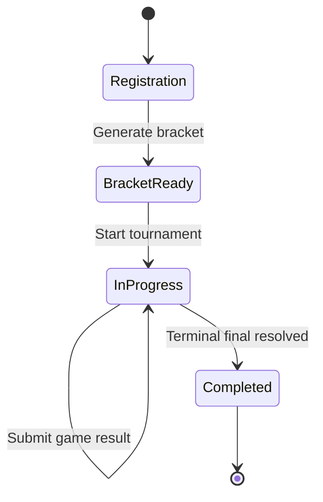

# Four Bagger

Four Bagger is a cornhole tournament application that organizes participants and teams, generates brackets, records
results, and advances winners automatically across singles and doubles play.

[View the live application](https://four-bagger.vercel.app)

Cornhole is a backyard game in which players or teams throw bags at raised boards; Four Bagger handles the tournament
organization around the game.

## Why I built it

Most weekends, my family and I get together for a cookout and play cornhole. When we organized tournaments, we would
manually draw brackets and assign teams.

I built Four Bagger to make that setup more streamlined while preserving the same playing experience we were already
used to. The most technically challenging part was modeling the tournament domain and its state transitions.

This repository contains the Spring Boot API. The React frontend is maintained separately as the deployed demonstration
client for the application.

## Technical highlights

- Stateful single- and double-elimination tournament progression with seeded brackets, byes, and format-specific routing
- HTTP-only cookie-based JWT authentication with rotating, one-way-hashed refresh tokens
- PostgreSQL-backed full-workflow integration tests using Spring Boot and Testcontainers
- GitHub Actions builds and validates a non-root container, publishes full-commit-SHA images to Amazon ECR, and supports
  manual promotion to AWS ECS Express

## Tournament workflows

The tournament workflows include:

- Tournament registration, lifecycle management, and completed-tournament retrieval
- Singles and doubles tournaments with single- or double-elimination formats
- Self-join tournaments using six-character join codes, or organizer-managed rosters with guest participants
- Random or organizer-defined manual doubles pairings, seeded brackets, and automatic byes
- Configurable best-of series by round, result recording, automatic progression, and organizer-only overrides while
  downstream play has not started

Tournaments move through four lifecycle stages:


```mermaid
stateDiagram-v2
    [*] --> Registration
    Registration --> BracketReady: Generate bracket
    BracketReady --> InProgress: Start tournament
    InProgress --> InProgress: Submit game result
    InProgress --> Completed: Terminal final resolved
    Completed --> [*]
```

### Games within tournament matches

Non-bye tournament matches contain one or more physical games, depending on the round's best-of configuration. Four
Bagger supports:

- Recording each physical game's two team scores
- Best-of-1, best-of-3, best-of-5, and best-of-7 series configured by round
- Sequential game-number validation with rejection of negative or tied scores
- Idempotent identical retries, with conflicting reuse of a game number rejected
- Match completion when a team clinches the series, followed by format-specific bracket progression

## Authentication and security

The API includes:

- Registration, login, logout, profile workflows, and stateless request authentication through Spring Security
- BCrypt password hashing; access JWTs and refresh tokens are issued in HTTP-only, `SameSite=Strict` cookies
- Refresh tokens rotate on use, are stored as one-way SHA-256 hashes, expire after seven days, and are purged daily
- Credential-aware CORS and in-process Bucket4j/Caffeine rate limiting protect authentication and join-code endpoints
- Central JSON error handling and production startup validation enforce required database settings, non-local CORS
  origins, secure cookies, and strong non-development JWT keys

## Tournament domain and design

The core domain is organized around the following relationships:

```text
Tournament
├── Participants
├── Teams
├── Rounds
│   └── Matches
│       └── Game results
```

Bracket generation is separated from tournament lifecycle management. Single-elimination and double-elimination brackets
each have dedicated generation and progression logic.

The tournament implementation handles several non-trivial cases:

- Power-of-two bracket sizing, top-seed byes, and automatic bye propagation
- Winners- and losers-bracket routing with team loss tracking and second-loss elimination
- Final and grand-final behavior, including reset-final routing when the first final does not eliminate the loser
- Series-clinching logic across configurable round formats
- Lifecycle and result invariants enforced in services, with optimistic locking on tournaments, matches, teams, and
  result records

These rules are kept in domain services and bracket components instead of being embedded directly in the HTTP
controllers. This keeps the tournament behavior testable and allows the API layer to remain focused on request handling
and response mapping.

## Architecture

Four Bagger is a single deployable Spring Boot service organized by feature.

```text
HTTP controllers
    → Domain and lifecycle services
    → Format-specific bracket generators and progression handlers
    → Spring Data JPA repositories
    → PostgreSQL
```

Packages are organized by feature around authentication, games, users, tournaments, security, configuration, shared
exceptions, and health checks.

- Controllers handle HTTP routes, request validation, and response mapping.
- Services enforce lifecycle, authorization, transaction, and domain rules.
- Dedicated bracket components isolate format-specific behavior.
- Spring Data JPA repositories manage persistence, while Flyway versions the PostgreSQL schema.
- Shared security and exception-handling components provide cross-cutting behavior.

## Technology stack

| Area                   | Technologies                                                                    |
|------------------------|---------------------------------------------------------------------------------|
| Language and framework | Java 25, Spring Boot 4.0.1                                                      |
| Web and persistence    | Spring MVC, Spring Data JPA, Hibernate                                          |
| Database               | PostgreSQL 16                                                                   |
| Schema management      | Flyway migrations with Hibernate schema validation                              |
| Authentication         | Spring Security, JJWT, BCrypt, HTTP-only cookies                                |
| Rate limiting          | Bucket4j and Caffeine                                                           |
| Testing                | JUnit, Mockito, Spring MVC tests, Spring Boot integration tests, Testcontainers |
| Build and packaging    | Maven Wrapper, multi-stage Docker image                                         |
| Delivery               | GitHub Actions, Amazon ECR, AWS ECS Express                                     |
| Demo client (separate) | React/TypeScript/Vite frontend deployed through Vercel                          |

## Run locally

### Prerequisites

- Docker with Docker Compose
- Java 25 is also required when running Maven commands directly

### Start the application

From the repository root:

```bash
docker compose up --build
```

This starts:

- PostgreSQL 16 on port `5432`
- The API on port `8080`
- Flyway migrations during application startup

The local API is available at:

```text
http://localhost:8080
```

Check that the application process is running:

```bash
curl http://localhost:8080/health
```

Stop the containers with:

```bash
docker compose down
```

The Docker Compose configuration is intended for local development.

## Configuration

Docker Compose supplies the local development configuration. Production configuration is provided through runtime
environment variables.

Required production variables include:

| Variable                 | Purpose                                                               |
|--------------------------|-----------------------------------------------------------------------|
| `SPRING_PROFILES_ACTIVE` | Must be set to `prod` for production configuration                    |
| `DB_URL`                 | PostgreSQL JDBC connection URL                                        |
| `DB_USERNAME`            | Database username                                                     |
| `DB_PASSWORD`            | Database password                                                     |
| `JWT_SECRET`             | Base64-encoded JWT signing key with at least 256 bits of key material |
| `ALLOWED_ORIGINS`        | Comma-separated list of permitted frontend origins                    |

Production startup validation rejects missing database settings, weak or known development JWT keys, localhost CORS
origins, and insecure authentication-cookie configuration.

## Testing

The test suite includes unit, MVC-slice, repository, migration, security, and full-workflow integration coverage for:

- Authentication, refresh tokens, and user management
- Tournament registration, lifecycle, bracket generation, and seeding
- Single- and double-elimination progression
- Guest rosters, result submission, and organizer overrides
- Persistence, migrations, rate limiting, and production configuration

The full-workflow tests exercise backend HTTP flows with Spring Boot and MockMvc; they do not include the separate
frontend or browser automation.

Run the tests with:

```bash
./mvnw -B -ntp test
```

The test profile uses Testcontainers to start a PostgreSQL 16 database, so Docker must be running.

The CI workflow also runs:

```bash
mvn -B -ntp clean verify
```

## Deployment

The backend is deployed through AWS ECS Express.

The separately maintained React frontend is deployed on Vercel and proxies `/api` requests to the deployed API; the live
demonstration link is above.

GitHub Actions builds and tests the application and validates a non-root production Docker image. Successful pushes to
`master` publish immutable full-commit-SHA images to Amazon ECR; a manual workflow promotes a selected SHA to AWS ECS
Express and waits for service stability.
